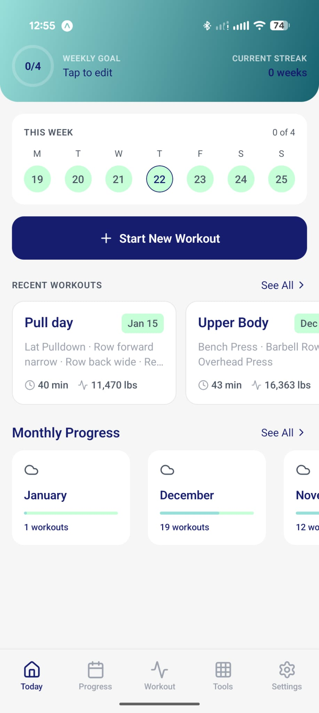
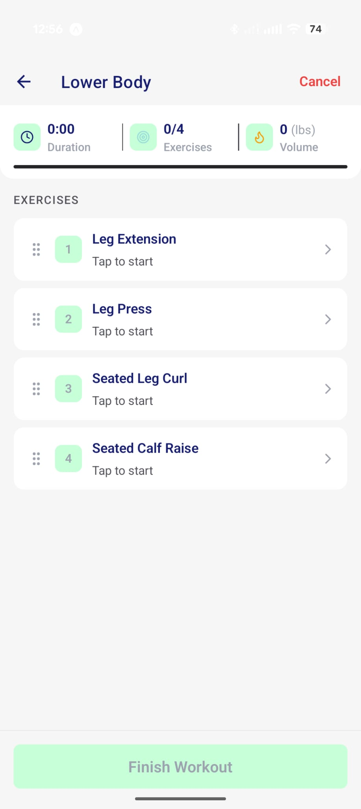
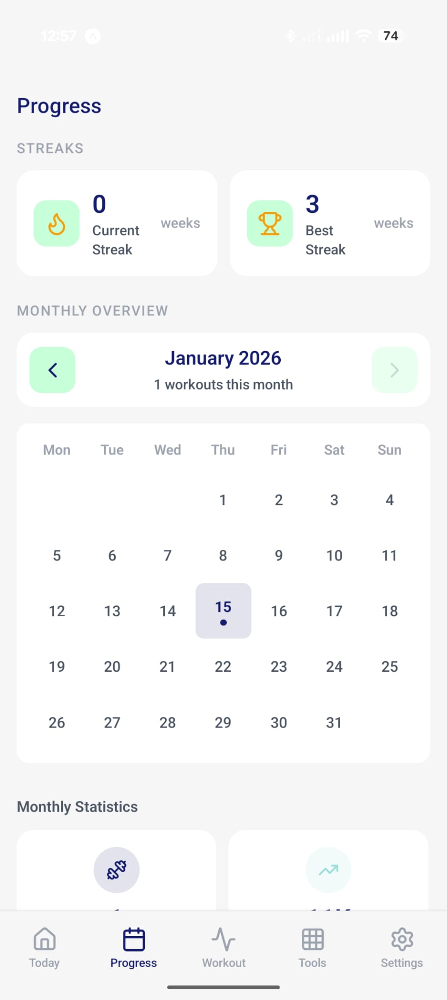
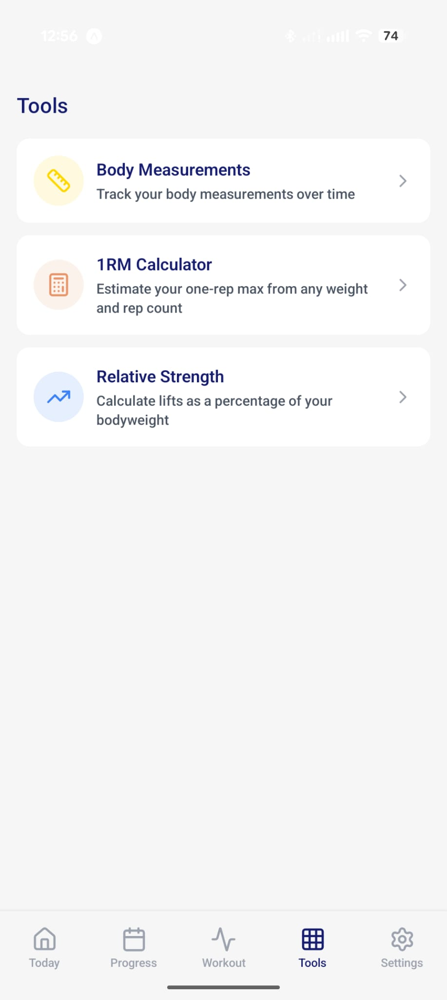
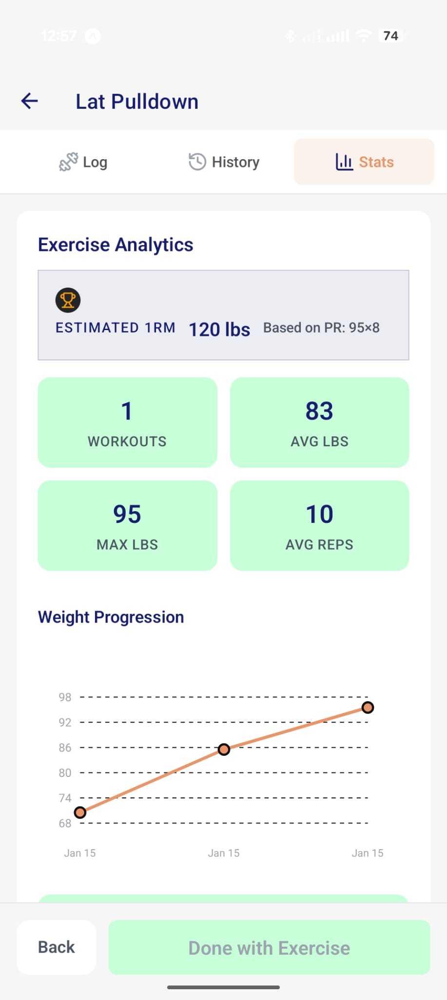
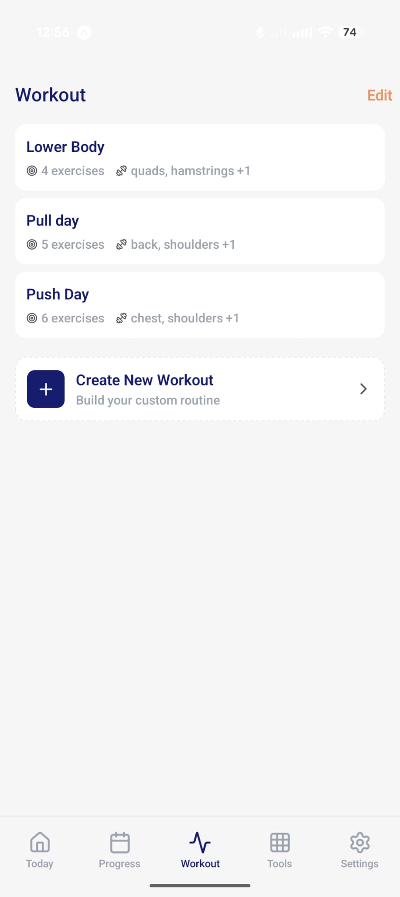
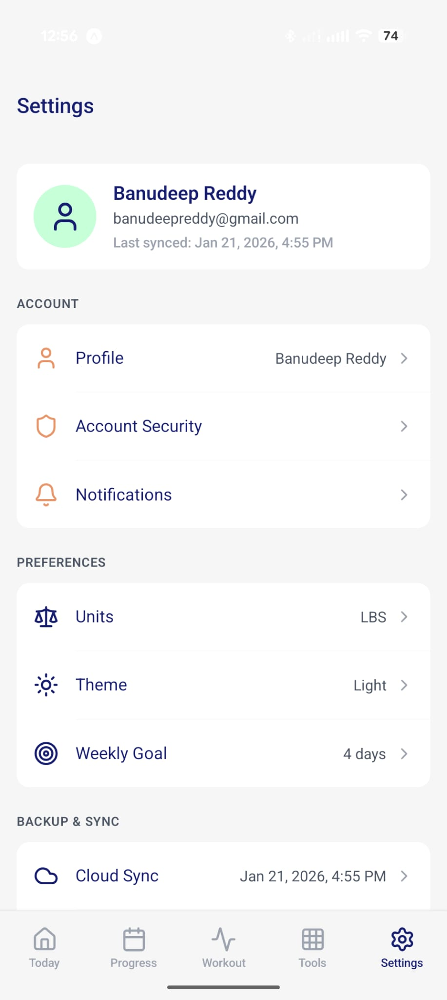
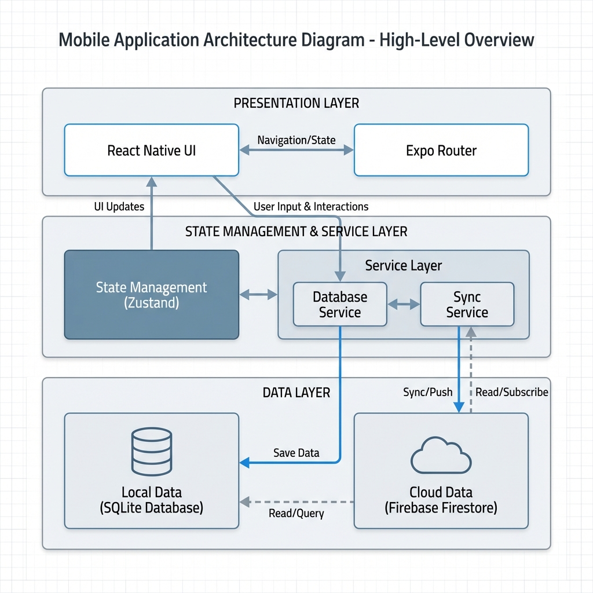

# FitTrack

A fitness tracking app I built for personal use to log my workouts and stay consistent.

## What It Does

- Log your exercises, sets, reps, and weight
- Track your progress over time with charts and stats
- See personal records and volume trends
- Create reusable workout templates
- Sync your data across devices with cloud backup

## Why I Built It

I wanted a simple way to log my workouts at the gym and see my progress. Having my history in one place keeps me motivated and helps me stay consistent with training.

---

## Screenshots

<!-- Replace these placeholders with actual screenshot paths -->

| Home | Workout | Progress | Tools |
|:----:|:-------:|:--------:|:-----:|
|  |  |  |  |

| Exercise Details | Templates | Settings |
|:----------------:|:---------:|:--------:|
|  |  |  |

---

## Features

### Workout Tracking
- **Custom Templates** – Create personalized workout routines with your favorite exercises
- **Live Logging** – Log sets, reps, and weight in real-time during workouts
- **Auto-Save** – Workouts save automatically; resume if interrupted
- **PR Detection** – Automatic personal record detection with celebratory animations
- **Volume Tracking** – See total volume lifted per workout

### Progress Analytics
- **Calendar Heatmap** – Visual monthly overview of workout frequency
- **Volume Charts** – Track progressive overload over time
- **Exercise History** – Detailed history for each exercise with all sets logged
- **Muscle Balance** – See which muscle groups you're training most
- **Recovery Status** – Know when each muscle group is ready to train again

### Fitness Tools
| Tool | Description |
|------|-------------|
| **1RM Calculator** | Estimate your one-rep max from any weight/rep combo |
| **Plate Calculator** | Calculate which plates to load on each side of the bar |
| **Relative Strength** | Compare your lifts to your bodyweight (Wilks-style) |
| **Body Measurements** | Track weight, chest, waist, arms, thighs over time |

### Account & Security
- Email/password authentication
- Google Sign-In and Apple Sign-In
- Secure password reset via email
- Change password from within the app
- Full account deletion with data cleanup
- FaceID / TouchID support (iOS)

### Cloud Sync
- **Automatic Backup** – Data syncs to Firebase when online
- **Multi-Device** – Access your workouts from any device
- **Offline First** – Full functionality without internet; syncs when reconnected
- **Conflict Resolution** – Smart merging of offline edits

### Customization
- **Dark/Light Mode** – Automatic theme switching or manual override
- **Imperial/Metric** – Choose lbs or kg for all weights
- **Weekly Goals** – Set and track weekly workout targets
- **Notifications** – Workout reminders and weekly summary alerts

---

## Getting Started

### Prerequisites
- **Node.js 18+**
- **npm** or **yarn**
- **Expo CLI**: `npm install -g expo-cli`
- **Expo Go** app on your phone (for testing)

### Installation

```bash
# Clone the repository
git clone <repository-url>
cd FitnessTracker

# Install dependencies
npm install

# Start the development server
npx expo start
```

### Running on Your Device
1. Scan the QR code with **Expo Go** (Android) or the **Camera** app (iOS)
2. Or press `a` for Android emulator / `i` for iOS simulator

---

## How to Use

### Starting a Workout
1. Go to the **Workout** tab
2. Select an existing template or create a new one
3. Tap **Start Workout**
4. For each exercise:
   - Enter your weight and reps for each set
   - Tap the checkmark to log the set
5. When finished, tap **Complete Workout**

<!--  -->
<!-- Replace with actual screenshot -->

### Tracking Progress
1. Go to the **Progress** tab
2. View your monthly calendar heatmap
3. Scroll down to see:
   - Volume trends
   - Muscle group distribution
   - Recovery status

<!--  -->
<!-- Replace with actual screenshot -->

### Viewing Exercise History
1. During a workout, tap on an exercise name
2. Or long-press any exercise in the exercise picker
3. View the **History** tab to see all logged sets
4. View the **Stats** tab for analytics and progression charts

<!--  -->
<!-- Replace with actual screenshot -->

### Using Fitness Tools
1. Go to the **Tools** tab
2. Select a calculator:
   - **1RM Calculator**: Enter weight and reps to see estimated max
   - **Plate Calculator**: Enter target weight to see plate breakdown
   - **Body Measurements**: Log and track body stats over time

### Syncing Data
1. Sign in via **Settings** > **Account**
2. Your data automatically syncs when online
3. To force sync: **Settings** > **Cloud Sync** > **Sync Now**

---

## Building for Production

### Local APK Build (Recommended for Quick Testing)

```bash
# Navigate to android folder
cd android

# Build the release APK
.\gradlew.bat assembleRelease   # Windows
./gradlew assembleRelease       # Mac/Linux
```

The APK will be output to:
```
android/app/build/outputs/apk/release/app-release.apk
```

**Prerequisites for local build:**
1. Ensure `android/local.properties` exists with your SDK path:
   ```
   sdk.dir=C:\\Users\\YourUsername\\AppData\\Local\\Android\\Sdk
   ```
2. If the native project is out of sync, run first:
   ```bash
   npx expo prebuild --platform android
   ```

### EAS Build (Cloud Build)

```bash
# Install EAS CLI
npm install -g eas-cli

# Login to Expo
eas login

# Build APK (Android - for testing)
eas build -p android --profile preview

# Build AAB for Play Store
eas build -p android --profile production

# Build for iOS App Store
eas build -p ios --profile production
```

---

## Tech Stack

| Category | Technology |
|----------|------------|
| Framework | React Native + Expo SDK 54 |
| Navigation | Expo Router (file-based) |
| State | Zustand |
| Database | SQLite (local) + Firebase Firestore (cloud) |
| Auth | Firebase Authentication |
| Animations | React Native Reanimated |
| Icons | Lucide React Native |
| Styling | React Native StyleSheet + dynamic themes |

---

## System Architecture

The app follows a **Local-First** architecture with robust cloud synchronization.



### Core Components

| Component | Responsibility |
|-----------|----------------|
| **Database Service** | Manages all local SQLite operations (CRUD for Workouts, Templates, Exercises). |
| **Sync Service** | Orchestrates data synchronization between SQLite and Firestore. Handles conflict resolution and offline queuing. |
| **Auth Store** | Manages user session and authentication state using Zustand and Firebase Auth. |
| **SQLite (Local)** | Primary source of truth for the UI. Ensures the app works 100% offline. |
| **Firestore (Cloud)** | Backup and multi-device sync storage. |

## License

MIT

---

## Contributing

Contributions are welcome! Please open an issue or submit a pull request.

---